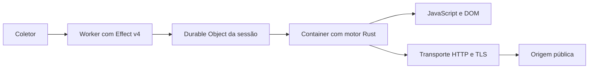

# Nimbo

Um navegador para scraping em massa, pensado primeiro para Cloudflare Containers: baixo consumo de memória, partida rápida e custo medido por página extraída.

**Status: primeiro MVP local implementado.** O motor Rust navega, executa um subconjunto de APIs web e extrai JSON por CLI. A infraestrutura Cloudflare, a compatibilidade ampliada e os benchmarks em produção abaixo ainda serão implementados. Nimbo é um projeto separado do outros motores usado atualmente pela consumidores.

## Desenvolvimento

O monorepo usa workspaces nativos do Bun para TypeScript e do Cargo para Rust:

```text
apps/worker/      @nimbo/worker — orquestração Cloudflare com Effect v4
crates/engine/   nimbo-engine — núcleo Rust e CLI de scraping
packages/        pacotes TypeScript compartilhados, quando houver consumidores
tooling/         testes da integração de lint
```

`packages/` só será criado quando necessário. As versões do Bun, Rust e das ferramentas
estão fixadas; os dois lockfiles devem ser versionados.

```sh
bun install --frozen-lockfile
bun run check
```

- `bun run lint`: Oxlint com verificação de tipos pelo Go e regras oficiais de Effect; Clippy para todos os crates, targets e features, sem warnings.
- `bun run format`: Oxfmt e rustfmt. `bun run format:check` verifica sem alterar arquivos.
- `bun run test`: probes que comprovam aceitação de Effect v4 válido e rejeição de Effect solto, erro de tipos, Promise solta, unwrap e unsafe; depois testes Rust.

O `prepare` reaplica o patch oficial `effect-tsgo patch --no-typescript --oxlint`
após instalar dependências. A configuração usa o preset strict de Effect e regras
contra `any`, operações inseguras e Promises sem tratamento. O mesmo comando
`bun run check` roda no CI em pushes e pull requests.

Referências: [integração oficial Effect/Oxlint](https://github.com/Effect-TS/tsgo/blob/main/docs/README.md),
[Oxlint com tipos](https://oxc.rs/docs/guide/usage/linter/type-aware) e
[Clippy](https://doc.rust-lang.org/stable/clippy/usage.html).

Os crates herdam `[workspace.lints]` com `all` e `pedantic`, proibição de unsafe
e regras contra unwrap/expect, TODOs executáveis, debug, saída abrupta e vazamento
via `mem::forget`. Novos crates devem declarar `[lints] workspace = true`.
Exceções pontuais precisam justificar a regra no local; não desligar categorias
inteiras para acomodar uma implementação.

A política Rust inclui regras selecionadas de `restriction` e `nursery`,
verificação de documentação e testes também em release. A pesquisa, decisões
e medições locais estão em [docs/rust-quality.md](docs/rust-quality.md).

## Primeiro MVP

O motor usa Rust para transporte e DOM, [QuickJS via rquickjs](https://docs.rs/rquickjs/0.14.0/rquickjs/)
para JavaScript e [dom_query/html5ever](https://docs.rs/dom_query/0.28.0/dom_query/)
para parsing e seletores. A ponte web é escrita em TypeScript, verificada pelo mesmo
Oxlint/Go e compilada pelo build do Cargo. O JavaScript gerado fica em `target/`,
sem arquivos `.js` escritos ou versionados. Bun e Effect são usados no build e
nas ferramentas; o binário final executa sozinho com QuickJS. Effect permanece
na orquestração e fora do contexto das páginas.

```sh
bun run test:browser
bun run browser https://example.com 'document.querySelector("h1").textContent'
```

Para experimentar sem rede externa, em um terminal:

```sh
python3 -m http.server 8080 --bind 127.0.0.1 --directory crates/engine/tests/fixtures
```

Em outro terminal:

```sh
bun run browser http://127.0.0.1:8080/static.html 'document.querySelector("h1").textContent'
# "Nimbo & dados"
```

A CLI recebe URL e uma expressão JavaScript opcional. Sem expressão, retorna
`{ url, title, text }`, onde `text` é `document.body.textContent`, sem limpeza de
scripts ou estilos. A saída é JSON em stdout; falhas vão para stderr com código
de saída diferente de zero. Resultados Promise são aguardados até o deadline.

O contrato Rust é `Browser::new(origin, limits)`, `navigate(url)` e
`Page::evaluate(expression)`. Cada Browser possui seu próprio cookie jar; cada
navegação possui DOM e runtime novos. Drop da página libera seus recursos. O
deadline cobre aquisição, scripts, fetch e extração; uma página expirada não pode
ser reutilizada. A origem autorizada é fixa e também limita redirects e subrequests.

| Superfície                                                                                               | Estado deste MVP                                            |
| -------------------------------------------------------------------------------------------------------- | ----------------------------------------------------------- |
| HTTP, redirects, URL final, cookies HttpOnly e isolamento entre sessões                                  | Validados com servidor local                                |
| HTTPS com verificação de certificados pelo transporte Rust                                               | Implementado; ainda sem corpus TLS dedicado                 |
| Seletores CSS, entidades HTML, atributos, textContent, innerHTML, criação, append e remoção de elementos | Validados localmente                                        |
| Scripts clássicos inline/externos, microtasks, fetch GET/POST com corpo string                           | Validados localmente, na mesma origem                       |
| DOMContentLoaded/load com callbacks função                                                               | Ciclo simplificado validado localmente                      |
| Limites de tempo, bytes recebidos, requests, operações/escritas de DOM e heap JS                         | Validados localmente                                        |
| Falhas e cleanup em 20 ciclos de criar/encerrar sessões                                                  | Validados; sem medição de RSS ou prova de ausência de leaks |
| Worker, Durable Objects, Containers e deploy Alchemy                                                     | Ainda não implementados                                     |
| CDP, screenshots, CSS/layout, stealth, XHR, timers, storage e APIs DOM completas                         | Ainda não implementados                                     |
| Modules, scripts async, frames e elementos base href                                                     | Rejeitados explicitamente                                   |

Scripts clássicos são executados em ordem **após o parsing completo**. Não há
execução intercalada com o parser nem agendamento completo de browser. O fetch
implementa apenas `method`/`body`, `status`/`ok`/`url` e `text()`/`json()`; não tem
headers customizados, streaming, CORS entre origens ou integração com AbortSignal.
As respostas precisam ser UTF-8 e a navegação precisa retornar `text/html`.
Recursos de estilos/imagens não são carregados.

Os limites padrão são 10 segundos por navegação, 2 MiB recebidos no total, 32
requests, 10 mil operações DOM, 4 MiB de escritas DOM acumuladas e heap JS de 32
MiB. O heap JS não representa o RSS total; parsing e callbacks nativos têm checks
cooperativos de deadline. A política de mesma origem não é um sandbox de processo
nem uma proteção completa contra SSRF/DNS rebinding. A CLI é para execução local;
antes de expor o serviço, serão necessários isolamento e política de rede no Container.

As dependências reutilizadas mantêm suas licenças: rquickjs/QuickJS e dom_query
(MIT), html5ever e reqwest (MIT ou Apache-2.0). Não há código do outros motores copiado neste MVP.
Os testes de browser são determinísticos e não usam credenciais nem destinos externos.

## Objetivo

Construir um navegador especializado nas necessidades de coleta da consumidores, aproveitando a experiência e as partes adequadas do outros motores. A prioridade é executar JavaScript e extrair conteúdo corretamente com o menor trabalho possível, preservando isolamento, segurança de transporte e controle de recursos.

Rust será o motor dentro do Container. Effect v4 será usado no Worker para contratos, orquestração e aquisição/liberação de sessões. As bibliotecas e os componentes reutilizados manterão suas licenças e atribuições.

## Arquitetura proposta



- **Worker:** autenticação, validação de contratos, limites, cancelamento, deadlines e observabilidade.
- **Durable Object:** um proprietário por sessão, com controle de concorrência e encerramento.
- **Rust:** execução de JavaScript, DOM, carregamento de recursos, extração e interface de automação.
- **Container:** imagem mínima, execução nonroot, limites explícitos e encerramento quando a sessão termina.

Effect não será instalado como um segundo runtime de execução dentro do motor. A comunicação deverá usar os mecanismos nativos da Cloudflare e contratos explícitos na fronteira com Rust.

## Cloudflare primeiro

O ciclo inteiro será tratado como parte do produto: disponibilizar a imagem, agendar o Container, iniciar o processo, obter a primeira extração e liberar a sessão.

A imagem será construída e publicada antes do deploy, com revisão e digest verificáveis. O deploy consumirá esse artefato pronto. Workers, Durable Objects e Containers serão declarados com Alchemy, sem um segundo proprietário de infraestrutura.

Cookies, credenciais e armazenamento do browser pertencerão à sessão. Pools de conexão e assets cacheáveis terão proprietário, orçamento e validade explícitos. Sessões encerradas não poderão manter páginas, tarefas ou dados de usuários anteriores.

## Desempenho e memória

A otimização será guiada por comparações reproduzíveis entre revisões, com a mesma carga e extração equivalente.

| Métrica             | O que será medido                                                                   |
| ------------------- | ----------------------------------------------------------------------------------- |
| Cold start completo | Agendamento, início do processo e primeira extração utilizável, separados por etapa |
| Latência            | p50, p95 e p99 de navegações e extrações                                            |
| CPU                 | Trabalho de processo e consumo observado na plataforma                              |
| RSS                 | Memória residente do motor ao longo da sessão e após a liberação de recursos        |
| PSS                 | Memória proporcional, reportada separadamente de RSS                                |
| Throughput          | Páginas válidas por segundo em concorrência limitada                                |
| Rede                | Requests físicos, bytes e reutilização de conexões/assets                           |
| Imagem              | Tamanho publicado e dependências incluídas                                          |
| Custo               | Custo por mil páginas válidas, incluindo falhas, retries e tempo ocioso             |

Metas numéricas serão fixadas por corpus após uma baseline real. Uma página vazia não será usada para justificar o dimensionamento de páginas com scripts, documentos ou desafios. A menor instância será escolhida apenas depois de validar headroom e comportamento sob pressão de memória.

As primeiras hipóteses serão evitar aquisições repetidas, cópias desnecessárias de buffers, retained heaps após navegações e trabalho em recursos que a extração não consome. Nenhuma remoção de capacidade será apresentada como ganho equivalente sem medir seu impacto.

## Compatibilidade de scraping

A primeira superfície deverá cobrir navegação HTTP/HTTPS, redirecionamentos, cookies, headers, GET/POST, scripts, DOM, fetch/XHR, páginas dinâmicas, paginação e iframes necessários às integrações.

CDP e clientes como Puppeteer/Playwright serão avaliados contra as operações efetivamente consumidas. A matriz de suporte distinguirá implementado, validado, parcial e não suportado. Renderização, screenshots e APIs adicionais entrarão no escopo conforme os fluxos exigirem; sua ausência será explícita.

## Stealth e fingerprint

Os testes avaliarão coerência entre identidade HTTP e JavaScript: User-Agent, locale, viewport, screen, webdriver, propriedades globais, descritores e comportamento de APIs. O transporte terá probes reais de ClientHello, ALPN e perfil TLS.

Identidades não poderão variar de forma contraditória entre navegações, requests e frames da mesma sessão. Superfícies não implementadas serão documentadas. Resultados de challenges serão reportados por destino, data, configuração e saída de rede; nenhum teste isolado será tratado como invisibilidade universal.

## Suíte de validação

- Corpus local determinístico com HTML estático, grandes tabelas, JavaScript dinâmico, paginação, charsets, assets compartilhados e iframes.
- Transporte real para cookies, isolamento entre sessões, headers, CORS, TLS, SSRF, redirects e limites de resposta.
- Cancelamento e interrupção durante aquisição, navegação, requests e extração, incluindo falhas parciais e cleanup.
- Carga prolongada com muitas navegações e ciclos de criar/encerrar sessões, acompanhando RSS, tarefas e descritores abertos.
- Pressão de memória, limites de CPU/concorrência e comportamento de encerramento no Container.
- Corpus público do consumidores, conferindo conteúdo principal completo e campos consumidos pelas integrações.
- Comparações com outros motores e outros motores sob a mesma carga, identidade, configuração e critério de resultado.

Testes locais não dependerão de credenciais ou de rede externa. Testes live e de Cloudflare terão comandos separados, configuração obrigatória e cleanup explícito. Testes de carga remotos usarão alvos próprios ou autorizados.

## Etapas

1. Inventariar capacidades do outros motores e fluxos reais; definir corpus, baseline e contratos mínimos.
2. Selecionar e adaptar o núcleo Rust, mantendo a execução de JavaScript e a extração verificáveis.
3. Implementar sessões e ciclo de vida no Worker com Effect v4 e recursos nativos da Cloudflare.
4. Construir a suíte de compatibilidade, isolamento, stealth e memória antes de ampliar concorrência.
5. Medir cold start, estabilidade e custo em Containers reais; otimizar os gargalos comprovados.
6. Migrar consumidores apenas quando a matriz de suporte e os resultados demonstrarem que o candidato atende aos fluxos exigidos.

## Critério de entrega

Cada release deverá identificar código, imagem, configuração e corpus usados; publicar a matriz de checks com falhas e limitações; e apresentar extração equivalente e métricas comparáveis. CI deverá verificar contratos, segurança, licenças e regressões antes da publicação.

O projeto começa pela evidência. Nenhum resultado do outros motores atual é um benchmark do Nimbo.
