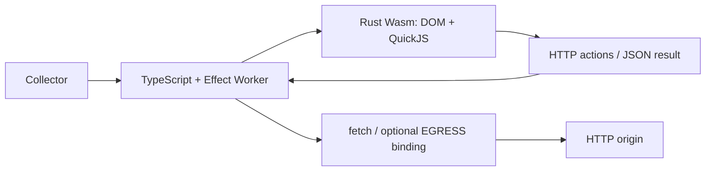

# Nimbo

A headless browser engine for scraping JavaScript-driven pages and SPAs. It loads a page, runs its JavaScript and extracts data from the resulting DOM.

Rust owns the browser implementation; QuickJS executes page JavaScript. The same engine runs as WebAssembly in Workers and celld, or through the native CLI.

Nimbo owns its browser implementation. Obscura is an optional, separate test comparator; it is never a runtime backend, dependency or fallback.

[Cloudflare guide](docs/cloudflare.md) · [celld guide](docs/celld.md) · [Browser coverage](docs/browser-coverage.md) · [Quality policy](docs/rust-quality.md)

## Getting started

Requirements: Bun, Rust, `clang`, `llvm-ar` and `wasm-ld`. The Rust toolchain configuration includes the Wasm target.

```sh
bun install --frozen-lockfile
cargo install wasm-bindgen-cli --version 0.2.129 --locked
bun run build:worker
bun run browser https://example.com 'document.querySelector("h1").textContent'
```

```sh
bun run check         # formatting, build, lint, tests, Rust docs and release tests
bun run test:worker   # real workerd execution, including local HTTP fixtures
bun run test:browser  # native HTTP adapter tests
```

The build produces `dist/worker/index.js` and `dist/worker/nimbo_engine_bg.wasm`. Generated artifacts are ignored by Git. Bun and Cargo workspaces use pinned dependencies and committed lockfiles.

## Architecture



The Rust engine produces HTTP actions and consumes responses. The host supplies transport and a monotonic clock. Page JavaScript runs in QuickJS, separate from host bindings and credentials. Cloudflare Workers and celld use the same prebuilt Worker/Wasm bundle; the native CLI uses a native HTTP adapter.

| Directory              | Purpose                                                         |
| ---------------------- | --------------------------------------------------------------- |
| `crates/engine/`       | Rust DOM, QuickJS execution, CSS, layout, canvas and native CLI |
| `apps/worker/`         | Worker API, authentication and transport                        |
| `apps/infrastructure/` | Alchemy Cloudflare stack                                        |
| `tooling/`             | Builds, real HTTP fixtures, tests and benchmarks                |
| `docs/`                | Coverage, evidence and runtime guides                           |

## HTTP API

`GET /health` returns the engine identity and version. `POST /scrape` requires the `API_TOKEN` binding and a bearer token. Keep the endpoint and token in private environment variables:

```sh
curl "$NIMBO_URL/scrape" \
  -H "Authorization: Bearer $NIMBO_API_TOKEN" \
  -H 'Content-Type: application/json' \
  --data '{"url":"https://example.com","expression":"document.title"}'
```

Successful responses contain `url`, `value` and `engine: "rust-wasm-quickjs"`. Failures return an HTTP status and an `error` field. Scraping is unavailable without an API token.

| Field                | Behavior                                                                                  |
| -------------------- | ----------------------------------------------------------------------------------------- |
| `url`                | HTTP destination                                                                          |
| `expression`         | JavaScript extraction expression                                                          |
| `scripts`            | `execute` by default; `skip` parses received HTML without loading or running page scripts |
| `maxStylesheetBytes` | CSS budget: 1 byte–2 MiB; default 256 KiB                                                 |
| `maxLayoutNodes`     | Visits per CSS collection/layout pass: 1–4096; default 1024                               |

The extraction expression still runs in `skip` mode. That mode does not hydrate JavaScript applications. Other request, DOM and execution limits still apply.

The optional `EGRESS` binding implements `fetch(Request): Promise<Response>`. Without it, the Worker uses its own `fetch`. Proxy credentials and destination policies belong in private configuration. Generic HTTP/CONNECT support does not establish controllable TLS fingerprints.

## Scraping scope

The core workflow is navigation, page JavaScript, asynchronous network activity,
DOM updates and extraction. Proxy configuration belongs to the transport. The
Worker currently accepts an optional `EGRESS` binding; native HTTP/CONNECT and
SOCKS proxy options are still pending. Proxy addresses and credentials stay in
private configuration.

[Obscura](https://github.com/h4ckf0r0day/obscura) runs JavaScript in V8 and provides scraping commands,
HTTP/SOCKS proxies and CDP automation, with optional rendering builds. [Kitesurf](https://developers.cloudflare.com/browser-run/kitesurf/)
provides an ephemeral Worker browser for agent tasks and content extraction.
Its [engine uses V8 isolates and Rust/Wasm](https://blog.cloudflare.com/kitesurf/);
video, WebGL, TLS fingerprint control and long-lived authenticated sessions
remain outside its documented scope.
These are references for Nimbo's browser contracts and efficiency. Current
compatibility and performance are measured below and in the coverage inventory.

## Browser capabilities

The engine implements bounded browser subsets. See the [coverage inventory](docs/browser-coverage.md) for individual contracts, real Chromium comparisons, known divergences and pending work.

| Surface                          | Current scope                                                                                                                                      |
| -------------------------------- | -------------------------------------------------------------------------------------------------------------------------------------------------- |
| HTML and DOM                     | Parsing, selectors, attributes, text, mutations and selected element interfaces                                                                    |
| JavaScript                       | Classic scripts, supported modules, live bindings, top-level await, Promises and bounded timers                                                    |
| HTTP                             | Redirects, shared HTTP/document cookies, page fetch and per-page isolation; simplified browser networking                                          |
| URL                              | Native parsing and form encoding, live URLSearchParams and bounded Web IDL bindings; original WPT failures remain                                  |
| Storage                          | Bounded local/session storage; Worker requests start fresh                                                                                         |
| CSS                              | Native declarations, selector matching, cascade and computed-style subsets                                                                         |
| Layout                           | Native block/flex/grid geometry, explicitly inset absolute/fixed boxes, selected sticky/scroll metrics and HTML categories; incomplete text layout |
| CSSOM                            | Constructed sheets, ordered live rule lists, declarations and Document adoption; grouped rules and document-owned wrappers pending                 |
| Canvas                           | Rust software OffscreenCanvas bitmap and selected 2D pixel operations                                                                              |
| Compatibility work still pending | Full HTML/CSSOM/WPT behavior, text shaping, painting, screenshots/PDF, WebGL, video, controllable TLS, durable browser sessions and CDP automation |

Scripts run after parsing; this is a simplified lifecycle. Frames are explicitly rejected. Images are not loaded. Import maps, JSON modules, IndexedDB and full CORS/networking contracts remain incomplete. Supported CSS metadata does not imply font rendering or painting.

Constructed CSSOM currently differs from Chromium for a non-configurable indexed rule-list definition. Document adoption is implemented, with two recorded cascade-order differences from Chromium. Mutating document-owned stylesheets is still pending. These divergences remain visible in the real fixtures and evidence.

## Resource limits

Each extraction owns its page and cookie jar. One active page per isolate is allowed; overlapping requests receive HTTP 429. Effect releases the page and permit on failures.

Defaults include a 10-second deadline, 2 MiB of accumulated HTTP responses, 32 physical requests including redirects, 10,000 DOM operations, 4 MiB of DOM writes, a 32 MiB QuickJS heap, a 64 KiB extraction expression and 10,000 microtasks. Timers have separate limits of 1024 pending timers and 10,000 callbacks.

QuickJS interrupt budgets bound JavaScript work; they are not elapsed milliseconds. Native callbacks have size/operation limits. The QuickJS heap limit does not describe total isolate memory. Same-origin restrictions do not provide complete SSRF or DNS-rebinding protection; operational destination policies need separate enforcement.

## Benchmarks

Run the Worker/Wasm benchmark **inside celld**:

```sh
bun run bench:celld
```

The runner starts an owned celld process and a real HTTP fixture, runs page JavaScript (including fetch, POST, timers, DOM mutations, events and module imports), verifies extraction values, excludes three warmups and reports 21 measured samples per scenario. It cleans up its process and temporary state. `CELLD_BINARY` optionally selects the executable. See the [celld guide](docs/celld.md) and [initial three-scenario results](docs/performance-celld.json).

```sh
cargo build --release -p nimbo-engine --locked
bun run bench:browser  # native CLI; a fresh process per extraction
bun run bench:worker   # an existing Worker endpoint; requires private environment settings
bun run bench:compare  # Nimbo in celld vs public Obscura vs unmodified Chromium
bun run bench:obstacle # original upstream obstacle fixtures in Nimbo/celld
bun run bench:wpt-url  # pinned original URL WPT window variants in Nimbo/celld
bun run bench:wpt-sticky # pinned original sticky WPT fixtures; optional Obscura comparator
```

Native CLI timings, local celld HTTP timings and deployed Cloudflare measurements are different measurements. The remote driver requires a fixture origin reachable from the Worker; the [Cloudflare guide](docs/cloudflare.md) explains that setup. Local measurements do not establish production throughput, memory use or cost.

See the [comparison guide](docs/benchmark-comparison.md) for the three-runtime benchmark, baseline failures and optimization results. Use the [engine build comparison](docs/benchmark-engine-comparison.md) to measure two Nimbo builds through the same celld HTTP adapter.

The [upstream benchmark matrix](docs/benchmark-reference-matrix.md) records exact suite obligations, immutable public source revisions and the first 33-stage Obscura obstacle baseline. Passing the internal suite does not establish an upstream stealth or framework pass.

### Current performance

Measured on 2026-10-04 with Nimbo's Worker/Wasm bundle inside celld 0.6.1,
public Obscura 0.2.3 and unmodified Chromium 153. Each extraction uses a fresh
page. Hosts stay running; runtime order rotates at concurrency 1. Three warmups
are excluded from 21 measured samples per scenario. All 648 attempts returned
the expected values over real HTTP, without mocks.

Latency in milliseconds, **p50 / p95**:

| Scenario                |  Nimbo / celld |        Obscura |        Chromium |
| ----------------------- | -------------: | -------------: | --------------: |
| Static HTML             |  33.13 / 79.72 |  18.48 / 25.62 |   65.32 / 83.56 |
| Selectors, 200 nodes    |  36.62 / 46.40 |  19.17 / 22.68 |   68.67 / 81.46 |
| Dynamic fetch           |  37.29 / 57.30 |  21.49 / 26.70 |   62.06 / 82.70 |
| JS, DOM and events      |  47.69 / 59.95 |  30.23 / 33.45 |   67.22 / 91.13 |
| JS modules              |  54.66 / 68.08 |  31.04 / 32.83 |   68.48 / 91.15 |
| JS selectors, 200 nodes |  53.55 / 67.06 |  31.65 / 36.10 |   67.11 / 89.14 |
| Static HTML, 5000 nodes | 56.60 / 104.83 |  47.65 / 63.94 | 269.76 / 366.09 |
| Selectors, 5000 nodes   |  65.83 / 81.96 | 98.28 / 144.52 | 270.10 / 306.98 |
| JS positioned boxes     |  57.67 / 80.14 |  31.28 / 43.50 |   70.75 / 94.30 |

Nimbo has a lower p50 than Chromium in **9/9** scenarios and Obscura in
**1/9**. Matching or beating Obscura across the remaining scenarios is still
pending. These local fixtures do not establish general SPA compatibility,
production throughput, memory consumption or cost. See the
[raw results](docs/performance-comparison-sticky.json) and
[reproduction guide](docs/benchmark-comparison.md).

## Runtime guides

- [Cloudflare Workers](docs/cloudflare.md): Alchemy configuration, secret binding, deployment and remote benchmarking.
- [celld](docs/celld.md): prebuilt Wasm execution, local development, benchmarks and deployment configuration.

The transport identifies itself as `Nimbo/0.1`. Upstream challenges fail explicitly. Nimbo currently makes no stealth or TLS fingerprint parity claim.

## Contributing

Run `bun run check` before submitting changes. New Rust crates inherit workspace lints. Keep examples synthetic and public: use `example.com` or reserved `.test` domains, and keep credentials, operational addresses, private checkout contents and infrastructure inventories out of commits and logs. Preserve credential scanning.
