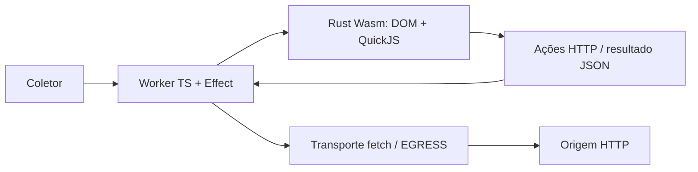

# Nimbo

Browser de scraping com **Rust e QuickJS compilados para Wasm, executados dentro de um Cloudflare Worker**. TypeScript com Effect v4 controla autenticação, transporte HTTP e liberação da página. Não depende de Containers.

O motor é independente: Obscura não é backend, dependência de runtime nem fallback. Seu executável pode ser usado separadamente como comparador opcional nos testes.

O MVP foi validado localmente no `workerd`, o runtime dos Workers, e também possui uma CLI nativa para desenvolvimento. Deploy, integração com proxies e medições de custo em produção ainda não foram validados.

## Monorepo

```text
apps/worker/     Worker TypeScript + Effect: API e transporte
crates/engine/   Rust: DOM, QuickJS, máquina de execução e CLI
tooling/        build, testes de lint, workerd e benchmark nativo
apps/infrastructure/  stack nativa Alchemy para o Worker e seu secret
```

Workspaces nativos Bun/Cargo, versões fixadas e lockfiles versionados. Todo código escrito no projeto é Rust ou TypeScript. O JavaScript necessário ao runtime é gerado em `target/` e `dist/`, ignorados pelo Git.

```sh
bun install --frozen-lockfile
# Rust instala o target wasm definido em rust-toolchain.toml.
# Também são necessários clang, llvm-ar e wasm-ld no PATH.
cargo install wasm-bindgen-cli --version 0.2.129 --locked
bun run check
```

`check` compila o Worker, verifica formatação, roda Oxlint com tipos e o preset oficial strict de Effect, Clippy nativo e Wasm sem warnings, testes Bun/workerd e Rust, documentação e testes Rust em release. Novos crates devem herdar `[lints] workspace = true`. A política e benchmarks nativos anteriores estão em [docs/rust-quality.md](docs/rust-quality.md).

```sh
bun run build:worker   # dist/worker/index.js + nimbo_engine_bg.wasm
bun run test:worker    # build e testes no workerd, sem rede externa
bun run test:browser   # testes do adaptador HTTP nativo
bun run browser https://example.com 'document.querySelector("h1").textContent'
```

## Worker e arquitetura



O núcleo Rust é uma máquina que produz ações HTTP e recebe respostas. Não abre sockets nem inicia threads. O mesmo núcleo atende ao Worker e à CLI; apenas o adaptador de transporte muda. Tokio não é necessário para esse alvo: o Worker já fornece o executor e o I/O assíncrono. JavaScript das páginas executa no QuickJS, separado das credenciais e bindings do host.

- `GET /health`: versão e identidade do motor.
- `POST /scrape`: `Authorization: Bearer <API_TOKEN>` e JSON `{ "url": "https://example.com", "expression": "document.title" }`.
- Sucesso: `{ "url": "URL final", "value": "resultado", "engine": "rust-wasm-quickjs" }`.
- Falha: status HTTP e `{ "error": "motivo" }`. Sem `API_TOKEN`, scraping fica indisponível.

Para HTML renderizado no servidor, envie `"scripts": "skip"`: scripts inline, externos, modules e async não executam nem são carregados. A expressão de extração continua usando o DOM recebido e QuickJS. O padrão `"scripts": "execute"` mantém a execução e as rejeições de scripts não suportados; não há fallback automático para conteúdo estático. Esse modo não hidrata aplicações nem produz conteúdo que depende de JavaScript.

O campo opcional `maxStylesheetBytes` configura o orçamento de CSS por página, de 1 byte a 2 MiB no Worker; o padrão é 256 KiB. Ele limita cada stylesheet, o texto CSS das folhas ativas e o cache de respostas CSS carregadas. Por exemplo, `"maxStylesheetBytes": 1048576` permite até 1 MiB. O orçamento de respostas HTTP, as cotas de regras/seletores e o deadline continuam aplicáveis. Na biblioteca Rust, configure `Limits::max_stylesheet_bytes`.

O artefato inclui o módulo Wasm pré-compilado e o secret `API_TOKEN`. A stack em `apps/infrastructure/alchemy.run.ts` usa o recurso nativo Worker do Alchemy com `bundle: false`, preservando o JavaScript e o módulo Wasm produzidos pelo build. `NIMBO_API_TOKEN` vem do ambiente privado e é declarado como secret via `Config.Redacted`; autenticação Cloudflare usa o fluxo nativo do Alchemy. Nenhuma credencial acompanha o projeto.

```sh
bun run dev:worker
bun run plan:worker
bun run deploy:worker
```

A stack usa o estado local nativo do Alchemy, em `.alchemy/`, ignorado pelo Git. Mantenha esse estado entre operações de deploy. O workspace de infraestrutura fixa Effect `4.0.0-rc.115`, compatível com os imports do Alchemy `2.0.0-beta.79`; o runtime do Worker continua no Effect `4.0.0`. Os overrides dos pacotes auxiliares mantêm essa compatibilidade na instalação reproduzível. O plano local não comprova deploy nem funcionamento no ambiente Cloudflare.

O binding opcional `EGRESS` implementa `fetch(Request): Promise<Response>`, permitindo um transporte separado sem acoplar protocolos ao motor. Sem binding, o transporte utiliza `fetch` do Worker diretamente. Tinyproxy usa HTTP/CONNECT com autenticação configurada somente em ambiente privado; suporte HTTPS no Worker exige validação do caminho TLS.

## Capacidades e limites

| Superfície                                                                         | Estado                                                                  |
| ---------------------------------------------------------------------------------- | ----------------------------------------------------------------------- |
| HTML, seletores CSS, atributos, texto, criação/remoção de elementos                | Implementados e testados                                                |
| Scripts clássicos inline/externos, Promises, GET/POST, ciclo DOMContentLoaded/load | Implementados com ciclo simplificado                                    |
| setTimeout/setInterval, cancelamento e queueMicrotask                              | Testados com relógio real no nativo e workerd                           |
| Redirects, cookies HttpOnly, isolamento entre páginas, liberação do Wasm           | Testados no workerd                                                     |
| Limites de bytes, requests, DOM, heap JS, instruções e microtasks                  | Implementados; testes locais de falha e recuperação                     |
| Proxy, deploy, custo, memória prolongada e throughput em produção                  | Pendentes                                                               |
| Geometria de caixas block/flex e grid automático                                   | Subconjunto nativo testado; textos, cascata e layout completo pendentes |
| Regras de style, prioridade, especificidade e grupos media                         | Subconjunto nativo testado; cascata completa pendente                   |
| Variáveis CSS herdadas, fallbacks e shorthands pendentes                           | Subconjunto nativo testado; ciclos comparados com Chromium              |
| Cascata completa, screenshots, Chromium/CDP, XHR e frames/idle                     | Não implementados                                                       |
| Modules com imports relativos, ciclos, bindings vivos e top-level await            | Testados no nativo e workerd                                            |
| Import maps, JSON modules e carregamento de novos imports dinâmicos                | Não implementados; scripts async rejeitados                             |
| localStorage/sessionStorage, cota UTF-16 e persistência entre navegações nativas   | Testados; Worker inicia áreas vazias por request                        |
| IndexedDB, storage events e sessões duráveis                                       | Não implementados                                                       |
| Estilos inline: parser CSS nativo, var/env e estado de shorthands                  | Subconjunto testado; CSSOM completo e estilos computados pendentes      |
| TextEncoder/TextDecoder, buffers e codecs Rust                                     | Testados; encoding streams e WPT completo pendentes                     |
| HTMLElement, namespaces e atributos refletidos básicos                             | Testados; interfaces específicas pendentes                              |
| Custom elements autônomos, upgrades, callbacks e whenDefined                       | Testados parcialmente; forms, shadow e registries scoped pendentes      |
| classList/DOMTokenList, mutações ordenadas e atributos vivos                       | Testados no nativo e workerd; cobertura parcial                         |
| matchMedia, viewport lógico e preferências explícitas                              | Testados; layout e eventos automáticos pendentes                        |
| HTMLAnchorElement, componentes URL, relList e base do documento                    | Testados; navegação e processamento de links pendentes                  |
| OffscreenCanvas, retângulos RGBA8 e leitura de pixels                              | Bitmap Rust nativo testado; Canvas completo e WebGL pendentes           |
| Frames                                                                             | Rejeitados explicitamente                                               |

Scripts executam em ordem após parsing completo. Fetch suporta `method`/corpo string, `status`/`ok`/`url`, `text()` e `json()`. Não implementa headers customizados nem CORS entre origens. HTML e respostas devem ser UTF-8; imagens não são carregadas; stylesheets externos são carregados no subconjunto CSS documentado. Não equivale à compatibilidade de Chromium.

OffscreenCanvas oferece um subconjunto de Canvas 2D com bitmap de software em Rust: fillRect, clearRect, alpha source-over, save/restore/reset, resize e ImageData. Os pixels são calculados pelo mesmo motor no nativo e no Worker. Cada bitmap tem no máximo 4096 pixels por dimensão e 1.048.576 pixels; a página limita bitmaps alocados a 16 MiB e 64 objetos. Métodos de desenho ausentes falham explicitamente. HTMLCanvasElement, imagens/textos, codificação de arquivos, screenshots e WebGL continuam pendentes; a comparação de limpeza fracionária ainda diverge do Chromium. Veja a [cobertura e as evidências](docs/browser-coverage.md#native-software-canvas-pixels).

Callbacks de timers executam no QuickJS da página; o host fornece tempo monotônico e atende esperas. Uma Promise de extração pendente avança tarefas futuras; uma extração já resolvida não espera todos os timers. O transporte HTTP permanece serializado. Os limites são 1024 timers pendentes e 10 mil callbacks por página, além do deadline total.

Cada extração cria uma página e cookie jar próprios. Uma página ativa por isolate, com excesso rejeitado em 429, limita sobreposição de heaps. Effect libera a página e o permit também em falhas. Os limites padrão são 10 s, 2 MiB de respostas acumuladas, 32 requests físicos incluindo redirects, 10 mil operações DOM, 4 MiB de escritas DOM, heap QuickJS de 32 MiB, expressão de 64 KiB, 512 callbacks de interrupção QuickJS e 10 mil microtasks.

O orçamento de interrupções mede trabalho do QuickJS, não milissegundos nem um número exato de instruções. Ele impede loops mesmo com o relógio restrito dos Workers; o timeout Effect limita I/O. Parsing e callbacks nativos têm limites de tamanho/operações, mas não podem ser preemptados pelo timeout. O heap QuickJS não representa toda a memória do isolate. Ciclos locais de criar/liberar páginas não provam ausência de leaks.

A política de mesma origem limita redirects e subrequests. Não é proteção completa contra SSRF/DNS rebinding; a política de destinos do proxy precisa ser definida antes de exposição pública em escala.

## Performance e stealth

O build Wasm usa o perfil release com otimização 3 e LTO. Benchmarks nativos não comprovam desempenho nem custo no Worker. As próximas medições devem comparar CPU, memória, latência e custo por mil extrações válidas, incluindo falhas e tráfego do proxy.

O transporte usa identidade explícita `Nimbo/0.1`. Challenges sinalizados pelo upstream falham explicitamente. Não há promessa de stealth: proxy muda a saída de rede, mas não cria compatibilidade de browser nem controla automaticamente o fingerprint TLS. ClientHello, APIs web e desafios precisam de provas por destino antes de qualquer alegação.

Referências da plataforma: [Wasm nos Workers](https://developers.cloudflare.com/workers/runtime-apis/webassembly/), [relógio e performance](https://developers.cloudflare.com/workers/runtime-apis/performance/), [limites](https://developers.cloudflare.com/workers/platform/limits/) e [preços](https://developers.cloudflare.com/workers/platform/pricing/).

Bibliotecas reutilizadas preservam suas licenças: QuickJS/rquickjs e dom_query (MIT), html5ever e reqwest (MIT ou Apache-2.0). Não há código de projetos privados copiado.
